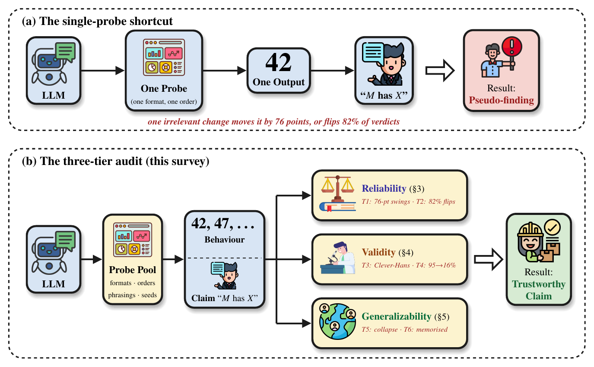

<div align="center">

# Can We Believe What Large Language Models Do?

### A Survey of Validity Threats in Behavioral Studies

**Dao Sy Duy Minh<sup>†</sup> · Huynh Trung Kiet<sup>†</sup> ·
Chi-Nguyen Tran · Nguyen Lam Phu Quy · Phu-Hoa Pham**

Faculty of Information Technology, University of Science, VNU-HCM  
<sup>†</sup>Equal contribution

[](latex/paper.pdf)
[](https://technoob05.github.io/llm-behavior-validity-survey/)
[](docs/surveyed-literature.md)
[](artifact/README.md)
[](LICENSE)

</div>

---

## Why this survey?

Behavioral studies often move from one model response to a broad statement such
as “the model has a personality,” “the model prefers cooperation,” or “this
judge is reliable.” That inference can fail even when the reported score is
correct. Wording, option order, scoring rules, the selected model population,
or the distance between a benchmark and deployment can change the conclusion.

This survey reorganizes the literature around one practical question:

> **What must remain stable before a tested response can support a broader
> claim about a language model?**

## What the paper contributes

| Contribution | What it adds |
|---|---|
| **Three-tier audit** | Checks reliability, validity, and generalizability in the order that failures can propagate. |
| **Six-threat taxonomy** | Connects prompt and format dependence, order effects, construct mismatch, scoring dependence, population simulation, and deployment transfer. |
| **Claim-centered checklist** | Lets an audit reject, narrow, or preserve a behavioral claim instead of treating every sensitivity as a universal failure. |
| **Fragility fraction, φ** | Reports the share of measured variation associated with one declared change to the test. |
| **Public reanalyses** | Reproduces examples on PromptEval/MMLU, MoralChoice, and MT-Bench using released model outputs and CPU-only code. |
| **Living evidence base** | Catalogues every cited work and provides correction and provenance rules for future updates. |

## The audit in one view

<p align="center">
  
</p>

1. **Reliability:** Would a reasonable change in prompt, format, order, or run
   reproduce the result?
2. **Validity:** Does the score measure the intended construct, and does the
   scoring rule preserve the relevant evidence?
3. **Generalizability:** Does the claim transfer beyond the tested items,
   models, languages, modalities, or deployment setting?

## Evidence at a glance

The headline results are deliberately claim-relative:

- In a matched item-level analysis, the tested dilemma claim was substantially
  more dependent on its probe variants than the matched MMLU claim.
- Three quarters of tested model pairs changed order somewhere across the
  MoralChoice variants.
- Position effects can remain large even when an automated judge is highly
  self-consistent across repeated calls.
- Some broad dispositional claims fail the full audit, while narrower claims
  about a named model, probe pool, and scoring rule survive.

These results do **not** claim that “behavior” is generally more fragile than
“capability.” Fragility belongs to a particular claim, probe axis, and model.

## Survey coverage

The manuscript cites **281 unique works** spanning:

- psychometrics and construct validity;
- prompt, format, and option-order sensitivity;
- machine psychology and personality measurement;
- preferences, strategic reasoning, and game-playing agents;
- social simulation and synthetic populations;
- LLM-as-a-judge reliability and scoring bias;
- contamination, benchmark validity, calibration, and inference;
- multilingual, multimodal, and deployment transfer.

Every cited work appears in the
[complete surveyed-literature catalogue](docs/surveyed-literature.md). Citation
identity, DOI/arXiv metadata, source availability, and URL checks are recorded
in the [citation-verification report](analysis/CITATION_VERIFICATION.md).

## Repository map

```text
analysis/      Reanalyses, numeric checks, and citation verification
artifact/      Reproducibility manifest, governance, and source provenance
docs/          Complete catalogue of the 281 surveyed works
experiments/   Runnable CPU studies and prepared extension protocols
latex/         Paper, figures, and ACL presentation source
scripts/       Surveyed-literature catalogue builder
website/       Responsive project website
```

Private reviewer material and downloaded source trees from other papers are not
part of this public repository or its history.

## Reproduce the core results

Python 3.10 or newer is recommended.

```bash
python -m pip install -r analysis/requirements.txt
pwsh artifact/fetch_public_sources.ps1
python analysis/test_public_core.py
```

The fetch command downloads pinned public releases and verifies the MT-Bench
judgment checksum. To rebuild every analysis output, follow
[artifact/README.md](artifact/README.md). The released analyses use existing
model outputs and do not require a GPU.

Build the paper:

```bash
cd latex
pdflatex -interaction=nonstopmode -halt-on-error paper.tex
bibtex paper
pdflatex -interaction=nonstopmode -halt-on-error paper.tex
pdflatex -interaction=nonstopmode -halt-on-error paper.tex
```

Build the literature catalogue:

```bash
python scripts/export_surveyed_literature.py
```

## Citation

```bibtex
@article{daosy2026believe,
  title   = {Can We Believe What Large Language Models Do?
             A Survey of Validity Threats in Behavioral Studies},
  author  = {Dao Sy, Duy Minh and Huynh, Trung Kiet and
             Tran, Chi-Nguyen and Nguyen, Lam Phu Quy and Pham, Phu-Hoa},
  year    = {2026},
  note    = {Preprint},
  url     = {https://github.com/technoob05/llm-behavior-validity-survey}
}
```

Machine-readable metadata are available in [CITATION.cff](CITATION.cff).

## Licence and provenance

Original code and documentation are released under the [MIT License](LICENSE).
Third-party datasets and model outputs retain their upstream licences and are
fetched from pinned public sources rather than redistributed. See
[THIRD_PARTY_ASSETS.md](artifact/THIRD_PARTY_ASSETS.md) for details.
